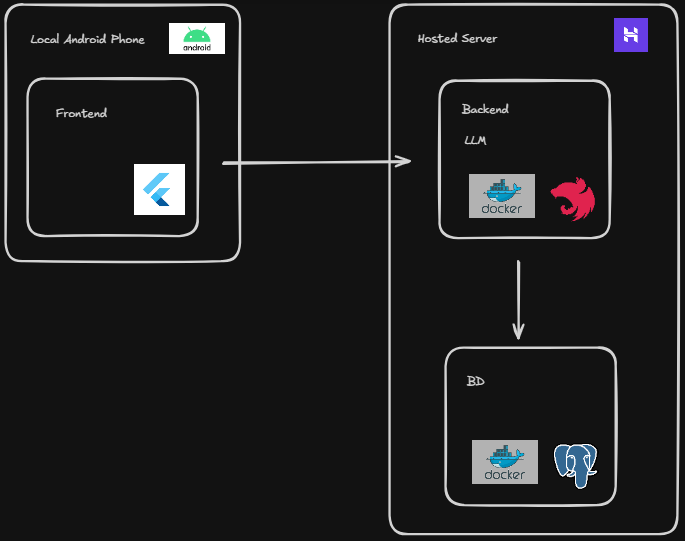

<br>

<p align="center">
    <a href="#sobre"> Sobre o projeto</a> &nbsp |&nbsp &nbsp
    <a href="#entregas"> Entregas </a> &nbsp |&nbsp &nbsp
    <a href="#tecnologias"> Tecnologias utilizadas </a> &nbsp |&nbsp &nbsp  
    <a href="#estrutura"> Estutura do projeto </a> &nbsp |&nbsp &nbsp  
    <a href="#backlog"> Backlog do produto </a> &nbsp |&nbsp &nbsp
    <a href="#autores"> Equipe </a> &nbsp |&nbsp &nbsp
    <a href="#links"> Links Úteis </a> 
</p>

<span id="sobre">

# 📑 Sobre o projeto

Nos últimos anos, o volume de processos judiciais e a complexidade das teses apresentadas cresceram de forma significativa, tornando mais difícil para juízes e assessores localizar rapidamente precedentes adequados e fundamentar decisões com agilidade e segurança. Esse cenário impacta diretamente a eficiência do Judiciário, prolongando a tramitação dos processos e aumentando o risco de decisões pouco alinhadas à jurisprudência consolidada.

Diante desse contexto, desenvolvemos o Veredito, um aplicativo voltado para magistrados e suas equipes, que recebe a petição inicial (por meio do envio de arquivos como PDF ou DOCX) e realiza a leitura e análise automática do conteúdo. A partir dessa análise, o Veredito gera um resumo da peça e identifica os precedentes mais relevantes relacionados à tese jurídica apresentada, apresentando informações como tribunal, tema, tese, espécie, status e grau de similaridade. Com isso, o sistema oferece uma lista de precedentes ranqueados e classificados quanto à sua aplicabilidade, apoiando a construção de decisões mais céleres, fundamentadas e alinhadas à jurisprudência.

<br>

# Requisitos funcionais

- **RFN01. Envio de Petição:** A aplicação deve permitir o envio de um arquivo contendo uma petição inicial.

- **RFN02. Geração de Resumo:** A aplicação deve gerar um resumo com as principais informações extraídas da petição inicial, como solicitação e tese, facilitando a compreensão e o direcionamento para a pesquisa de precedentes.

- **RFN03. Sugestão de Precedentes:** Dado uma petição inicial, a aplicação deverá sugerir precedentes judiciais que possam ser utilizados no caso, contendo dados estruturados como tribunal/origem, tema, enunciado, status, tese firmada, espécie e data de atualização.

- **RFN04. Filtro de Precedentes:** Na listagem dos precedentes sugeridos, a aplicação deve oferecer a opção de filtrar por tribunal, espécie de precedente e status.

- **RFN05. Cálculo de Similaridade:** Para cada precedente sugerido, a aplicação deve calcular e exibir um percentual de similaridade ou a probabilidade de o precedente ser aplicado ao caso concreto.

- **RFN06. Classificação de Aplicabilidade:** Para cada precedente sugerido, a aplicação deve rotular cada resultado com uma indicação clara: "Aplicável", "Possivelmente aplicável" ou "Não aplicável".

- **RFN07. Geração de Síntese Explicativa:** Para cada precedente sugerido, a aplicação deve gerar um texto curto explicando a relação lógica/jurídica entre o precedente encontrado e a petição inicial do usuário.

- **RFN08. Histórico de Petições:** A aplicação deve manter um histórico detalhado de cada petição enviada ao sistema, incluindo a síntese gerada, os precedentes sugeridos e a data cujo a ação foi realizada.

- **RFN09. Cadastro de Usuários:** A aplicação deve permitir o registro de um novo usuário, solicitando informações como nome completo, e-mail e senha.

- **RFN10. Envio de Processo Jurídico:** O sistema deve permitir o envio de arquivos contendo processos jurídicos completos e a inserção do contexto do tribunal, possibilitando o armazenamento e processamento das informações para análise posterior.

- **RFN11. Classificação das Partes de um Processo:** Dado um processo jurídico completo, o sistema deve classificar automaticamente partes relevantes, como petição inicial, contestação, recurso e sentença/acórdão.

- **RFN12. Geração de Minuta de Sentença:** O sistema deve permitir a geração automática de uma minuta de sentença a partir de um processo jurídico enviado, considerando as decisões, parâmetros e informações definidos pelo usuário.

- **RFN13. Geração de Minuta de Petição Inicial:** O sistema deve permitir a geração automática de uma minuta de petição inicial com base na descrição e nas informações fornecidas sobre o caso, contendo fatos estruturados, fundamentos jurídicos e precedentes relevantes destacados.

- **RFN14. Edição de Minuta de Petição Inicial:** O sistema deve permitir que o usuário edite as minutas de petições iniciais geradas, possibilitando alterações no conteúdo antes da finalização do documento.

- **RFN15. Exportação de Minuta de Petição Inicial:** O sistema deve permitir a exportação das minutas de petições iniciais geradas em formato de arquivo, possibilitando seu download.

<br>

<span id="backlog">

# 🎯 Backlog do Produto

| **RFN** | **Rank** | **Prioridade** | **User Story** | **Estimativa** | **Sprint** | **Critérios de Aceitação** |
| ------- | -------- | -------------- | -------------- | -------------- | ---------- | -------------------------- |
| 01 | 1 | Alta | Como juiz, quero fazer o upload do arquivo da minha petição inicial para que o sistema possa analisar os fatos envolvidos. | 5 | 1 | - Suporte aos formatos `.docx`, `.pdf`, `.txt`;<br>- Confirmação visual de que o arquivo foi recebido com sucesso;<br>- Mensagem de erro caso o arquivo não seja suportado. |
| 01 | 2 | Alta | Como novo usuário, desejo poder me cadastrar para obter acesso ao sistema e poder utilizar todas as suas funcionalidades. | 3 | 1 | - Campos obrigatórios: Nome completo, e-mail válido e senha segura;<br>- A senha deve conter no mínimo 8 dígitos, um caractere especial e um número;<br>- O sistema deve impedir cadastros com e-mails existentes. |
| 03 | 3 | Alta | Como juiz, desejo receber sugestões de precedentes para identificar quais podem auxiliar na minha tomada de decisão. | 13 | 1 | - Listar tribunal, tema, enunciado, status e tese firmada, data de atualização e espécie. |
| 05 | 4 | Alta | Como juiz, desejo que cada precedente sugerido apresente um percentual de similaridade com o caso, para que eu possa julgar quais podem ser utilizados. | 5 | 2 | - Exibir em porcentagem (%) o índice de similaridade semântica. |
| 06 | 5 | Alta | Como juiz, desejo que cada precedente sugerido apresente um indicador claro de aplicabilidade no caso, para que eu possa identificar facilmente se ele é relevante para a minha decisão. | 3 | 2 | - Classificar entre: "Aplicável", "Possivelmente aplicável" ou "Não aplicável";<br>- Mostrar uma legenda com o parâmetro de classificação;<br>- Faixa de Classificação:<br>&nbsp;&nbsp;- `>= 70%`: Aplicável;<br>&nbsp;&nbsp;- `> 40% e < 70%`: Possivelmente aplicável;<br>&nbsp;&nbsp;- `<= 40%`: Não aplicável. |
| 07 | 6 | Alta | Como juiz, eu quero ler uma síntese explicativa da relação entre o precedente e minha petição para entender o porquê daquela sugestão e usá-la na minha fundamentação. | 8 | 2 | - Texto curto, no máximo um parágrafo;<br>- Deve descrever a correlação entre o precedente e a petição enviada. |
| 02 | 7 | Média | Como juiz, quero visualizar um resumo automático da petição enviada para que eu possa identificar rapidamente os que podem auxiliar na minha tomada de decisão. | 5 | 2 | - O resumo deve destacar claramente a "Tese Jurídica" e a "Solicitação/Pedido";<br>- No máximo um parágrafo, escrito de forma clara e concisa. |
| 10 | 8 | Alta | Como juiz, desejo enviar arquivos contendo processos jurídicos completos e inserir o contexto do tribunal, para que eu possa os analisar posteriormente. | 5 | 3 | - Suporte aos formatos `.docx`, `.pdf`, `.txt`;<br>- Confirmação visual de que o arquivo foi recebido com sucesso;<br>- Formulário para a coleta do contexto do tribunal, contendo: tribunal, instância, classe processual e área do direito;<br>- O campo de tribunal deve ser preenchido com base nos tribunais registrados no sistema;<br>- Mensagem de erro caso o arquivo não seja suportado. |
| 11 | 9 | Alta | Como juiz, devo visualizar todas as partes do processo classificadas devidamente, para que eu possa visualizar de forma clara todo seu conteúdo facilmente. | 13 | 3 | - Obrigatoriamente, todo processo deve ter uma petição inicial;<br>- Caso haja, devem ser classificados: contestação, recurso, sentença/acórdão. |
| 12 | 9 | Alta | Como juiz, desejo gerar automaticamente uma minuta de sentença com base em um processo jurídico enviado, para que eu possa obter uma versão inicial do documento formalizando minha decisão e considerando as informações do processo. | 8 | 3 | - Exportar a minuta em um arquivo PDF;<br>- Antes, solicitar as seguintes informações através de um formulário: descrição da decisão e precedentes sugeridos para serem selecionados;<br>- A minuta deve conter as informações necessárias para formalizar a decisão com base no processo enviado. |
| 13 | 10 | Alta | Como advogado, desejo gerar automaticamente uma minuta de petição inicial a partir da descrição e das informações do caso, para que eu tenha uma versão inicial estruturada do documento jurídico. | 8 | 3 | - As seguintes informações devem estar contidas: fatos estruturados, fundamentos jurídicos, tese central, pedidos e citações de precedentes com trechos destacados;<br>- Formulário para preencher a descrição do caso, pedindo: área do direito, pedidos principais, tribunal/UF, tese pretendida e upload de documentos. |
| 14 | 11 | Alta | Como advogado, quero editar o conteúdo da minuta de petição inicial gerada, para que eu possa ajustar o documento antes de finalizá-lo. | 3 | 3 | - Para cada campo da minuta, deve ser possível editar e salvar automaticamente;<br>- Nenhum campo pode ser enviado vazio;<br>- Mensagem de erro caso as regras de validações sejam quebradas. |
| 15 | 12 | Alta | Como advogado, quero exportar a minuta de petição inicial em formato de arquivo, para que eu possa realizar o download e utilizar o documento posteriormente. | 3 | 3 | - O arquivo deve ser gerado no formato DOCX;<br>- O arquivo deve ser salvo automaticamente na pasta de Downloads;<br>- O nome do arquivo deve permitir identificar a minuta exportada;<br>- Mensagem de aviso informando caso o download não possa ser realizado. |
| 04 | 14 | Média | Como juiz, quero filtrar a busca por precedentes por tribunal ou espécie para focar apenas nas decisões que são vinculantes ou do meu estado. | 5 | 3 | - Filtros funcionais para Tribunal, por exemplo: STJ, STF, TJSP;<br>- Filtros por Espécie, por exemplo: IRDR, Recurso Repetitivo;<br>- Os filtros devem ser aplicados antes da busca de precedentes. |
| 08 | 15 | Baixa | Como juiz, eu quero acessar o histórico das petições analisadas anteriormente para recuperar análises já feitas sem precisar reenviar os arquivos. | 3 | 3 | - Exibir a data e hora em que o processo foi realizado;<br>- Listar nome do arquivo, resumo gerado e precedentes sugeridos, com os indicadores de aplicabilidade e síntese explicativa. |

<br>

<span id="entregas">

# 🏁 Entregas de Sprints

Cada entrega foi realizada a partir da criação de uma **tag** em cada repositório, além da criação de uma branch neste repositório com um relatório completo de tudo o que foi desenvolvido naquela sprint.
| Sprint | Previsão de entrega | Status | Histórico |
|:--:|:----------:|:-------------------|:-------------------------------------------------:|
| 01 | 16/03/2025 a 05/04/2025 | Concluída ✔ | [Ver relatório](https://github.com/SkyFlyTeam/veredito-documentation/tree/sprint1) |
| 02 | 13/04/2025 a 03/05/2025 |  Concluída ✔ | [Ver relatório](https://github.com/SkyFlyTeam/veredito-documentation/tree/sprint2) |
| 03 | 11/05/2025 a 31/05/2025 | Concluída ✔ | [Ver relatório](https://github.com/SkyFlyTeam/veredito-documentation/tree/sprint3) |

<br />

<span id="tecnologias">

# 🛠️ Tecnologias Utilizadas

As seguintes ferramentas, linguagens, bibliotecas e tecnologias foram usadas na construção do projeto:


<br>

# Manual de Usuário e Instalação

O manual de instalação pode ser acessado através do seguinte link: [Manual de Instalação](./mgt/Veredito%20-%20Manual%20de%20Instalação.pdf)

O manual do usuário pode ser acessado através do seguinte link: [Manual do Usuário](./mgt/Veredito%20-%20Manual%20do%20Usuário.pdf)


<span id="estrutura">

# Estrutura do Projeto




## Como executar o projeto

1 . Clone os repositórios:
- [Necessita do git instalado](https://git-scm.com/downloads)
```
git clone https://github.com/SkyFlyTeam/veredito-frontend.git
git clone https://github.com/SkyFlyTeam/veredito-backend.git
```

2 . Configurando e executando backend: 
- [Necessita do node.js 20.17](https://nodejs.org/pt)
- [Necessita do postgres 18](https://hub.docker.com/_/postgres)

Na pasta do backend:
- Crie um arquivo chamado ".env" e insira as seguintes informações:
```
DB_NAME='Nome da database do banco'
DB_USER='postgres'
DB_PASSWORD='Senha do banco de dados'
DB_HOST='Ip do bando de dados'
DB_PORT=Porta do banco de dados (5432 por padrão)
```

Instale as depêncencias do projeto:
```
npm install
```

Inicie o backend:
```
npm start
```

3 . Configurando e executando o frontend
- [Necessita do Flutter](https://docs.flutter.dev/install)

Na basta do frontend, execute:

Para instalar as dependências do projeto:
```
flutter pub get
```

Para iniciar o projeto:
```
flutter run --flavor dev
```


## DoR (Definition of Ready) 

- **User Stories completas:** Todos os requisitos descritos em User Stories planejadas para caber na sprint.
- **Tarefas detalhadas e atribuídas:** Cada User Story deve ter ao menos uma task detalhada e atribuída a um responsável.
- **Critérios de aceitação definidos:** Cada User Story deve ter critérios de aceitação bem estabelecidos.
- **Estimativas definidas:** Todas as User Stories devem ter uma estimativa de esforço/tamanho feita pelo time
- **Wireframe/Mockup aprovados:** O cliente deve ter validado e aprovado os protótipos visuais.
- **Modelo de dados finalizado:** Estrutura de dados completamente definida e documentada.
- **Testes de aceitação definidos:** Incluindo testes sugeridos pelo cliente e testes de aceitação.
- **Ambiente de desenvolvimento pronto:** O time deve ter acesso a todos os ambientes, ferramentas e permissões necessárias.

<br>

## DoD (Definition of Done) 

- **Critérios de aceitação validados:** Todos os critérios de aceitação foram atendidos e verificados com testes apropriados.
- **Execução de testes adequados:** Testes unitários, de integração e de aceitação foram realizados para garantir a estabilidade e funcionamento correto da aplicação.
- **Código-fonte completo e padronizado:** O código está 100% implementado, refatorado e segue as boas práticas e padrões de qualidade definidos.
- **Commits organizados e documentados:** Os commits seguem a nomenclatura acordada, são claros, segmentados e possuem histórico bem documentado.
- **Guia de instalação detalhado:** A documentação de instalação é clara e completa, permitindo que qualquer usuário ou desenvolvedor configure e execute a aplicação sem dificuldades.
- **Manual do usuário disponível:** Um manual foi criado para orientar o cliente sobre o funcionamento da aplicação.

<br>

<span id="links">

# 🔗 Links úteis
- [Modelo lógico do Banco de Dados](https://drive.google.com/drive/u/0/folders/1ygoHa6sKV5rbtAdRM1MXXLF_uZXHqHLZ)
- [Product backlog detalhado](https://docs.google.com/document/d/1ccq_H_ighBNAnQGasE96qoWzPDBUzh8qnafRRzzu0S4/edit?usp=drive_link)
- [Wireframe da aplicação](https://www.figma.com/design/lil1yJQnbpxD0KT1nYMGMY/Veredito?node-id=46-747&p=f&t=1BYsslYJooGG2601-0)
- [Arquitetura do projeto](https://drive.google.com/file/d/1qUUGlycurkHo2hB_AhqxmZaqfp-lcXRD/view?usp=drive_link)
- [Fluxo de trabalho no git](https://drive.google.com/file/d/1FrOnW7kL2z8Eq5TEqqtXiip583erGgH-/view?usp=drive_link)
- [Estratégia de branch](https://drive.google.com/file/d/1FrOnW7kL2z8Eq5TEqqtXiip583erGgH-/view?usp=drive_link)
<br>


<span id="autores">

# 👥 Equipe


|    Função     | Nome                                  |                                                                                                                                                      LinkedIn & GitHub                                                                                                                                                      |
| :-----------: | :------------------------------------ | :-------------------------------------------------------------------------------------------------------------------------------------------------------------------------------------------------------------------------------------------------------------------------------------------------------------------------: |
| Team Member   | André Salerno |      [](https://www.linkedin.com/in/andresalerno/) [](https://github.com/andresalerno)     |
|  Scrum Master  | Brenno Rosa Lyrio de Oliveira               |   [](https://www.linkedin.com/in/brennolyrio/) [](https://github.com/BrennoLyrio)   |
| Team Member   | Eric Lourenço Mendes da Silva      |         []() [](https://github.com/ericloumendes)        |
|  Product Owner  | Karen de Cássia Gonçalves     |           [](https://www.linkedin.com/in/karen-cgonçalves) [](https://github.com/karengoncalves8)   |
|  Team Member  | Guilherme dos Santos Benedito               |   [](https://www.linkedin.com/in/guilherme-benedito/) [](https://github.com/gui-benedito)   |
|  Team Member  | Ivan Suiyama Silva             |   [](https://www.linkedin.com/in/IvanSuiyama/) [](https://github.com/IvanSuiyama)   |
